# Duomenų bazės struktūra - Obuolys projektas

Šis dokumentas aprašo **ponasObuolys** projekto duomenų bazės struktūrą Supabase platformoje.

## Projekto informacija

- **Projekto ID**: `jzixoslapmlqafrlbvpk`
- **Projekto pavadinimas**: ponasObuolys
- **Regionas**: eu-central-1
- **Statusas**: ACTIVE_HEALTHY
- **PostgreSQL versija**: 15.8.1.054
- **Sukurta**: 2025-03-30T18:14:49.276346Z
- **Paskutinis atnaujinimas**: 2025-10-23

## Turinys

1. [Lentelių schema](#lentelių-schema)
2. [Lentelių aprašymas](#lentelių-aprašymas)
3. [Indeksai](#indeksai)
4. [RLS politikos](#row-level-security-rls-politikos)
5. [Funkcijos](#funkcijos-ir-triggeriai)
6. [Triggeriai](#triggeriai)
7. [Peržiūros (Views)](#peržiūros-views)
8. [Migracijos](#migracijos)
9. [Storage konfigūracija](#storage-konfigūracija)
10. [Saugumo funkcijos](#saugumo-funkcijos)

## Duomenų bazės schema

### ER diagrama

```mermaid
erDiagram
    %% PUBLIC SCHEMA - CORE TABLES
    profiles {
        uuid id PK,FK
        text username UK
        text avatar_url
        boolean is_admin
        text role
        timestamptz created_at
        timestamptz updated_at
    }

    articles {
        uuid id PK
        text title
        text slug UK
        text description
        text content
        text read_time
        text author
        date date
        text[] category
        text image_url
        text content_type
        boolean featured
        boolean published
        timestamptz created_at
        timestamptz updated_at
    }

    tools {
        uuid id PK
        text name
        text slug UK
        text description
        text url
        text image_url
        text category
        boolean featured
        boolean published
        timestamptz created_at
        timestamptz updated_at
    }

    courses {
        uuid id PK
        text title
        text slug UK
        text description
        text content
        text price
        text duration
        text level
        text[] highlights
        text image_url
        boolean published
        timestamptz created_at
        timestamptz updated_at
    }

    %% USER ENGAGEMENT TABLES
    article_comments {
        uuid id PK
        uuid article_id FK
        uuid user_id FK
        uuid parent_id FK
        text content
        boolean is_approved
        boolean is_deleted
        timestamptz created_at
        timestamptz updated_at
    }

    article_bookmarks {
        uuid id PK
        uuid article_id FK
        uuid user_id FK
        timestamptz created_at
    }

    reading_progress {
        uuid id PK
        uuid article_id FK
        uuid user_id FK
        integer progress_percentage
        integer last_position
        boolean completed
        timestamptz created_at
        timestamptz updated_at
    }

    page_views {
        uuid id PK
        uuid article_id FK
        uuid user_id FK
        text session_id
        timestamptz viewed_at
        text user_agent
        inet ip_address
    }

    %% ANALYTICS & MARKETING TABLES
    cta_sections {
        uuid id PK
        text title
        text description
        text button_text
        text button_url
        varchar context
        varchar variant
        varchar icon
        integer priority
        boolean is_sticky
        boolean active
        timestamptz created_at
        timestamptz updated_at
    }

    sticky_cta_messages {
        uuid id PK
        text title
        text description
        text cta
        varchar emoji
        integer priority
        boolean active
        timestamptz created_at
        timestamptz updated_at
    }

    cta_clicks {
        uuid id PK
        uuid cta_id
        text cta_type
        timestamptz clicked_at
        text user_session_id
        text page_url
        text context
        timestamptz created_at
    }

    site_statistics {
        uuid id PK
        integer year UK
        integer total_visitors
        integer total_page_views
        timestamptz last_updated
    }

    %% CONTACT & INQUIRY TABLES
    contact_messages {
        uuid id PK
        text name
        text email
        text subject
        text message
        text status
        timestamptz created_at
    }

    custom_tool_inquiries {
        uuid id PK
        text full_name
        text email
        text phone
        text company_name
        text company_size
        text project_type
        text budget_range
        text timeline
        text description
        text current_solution
        text team_size
        text status
        text notes
        text admin_notes
        boolean gdpr_consent
        text source
        text ip_address
        text user_agent
        timestamptz created_at
    }

    email_replies {
        uuid id PK
        uuid inquiry_id
        text inquiry_type
        text recipient_email
        text subject
        text message
        uuid sent_by FK
        timestamptz sent_at
        text delivery_status
        text error_message
        timestamptz created_at
        timestamptz updated_at
    }

    %% CONTENT MANAGEMENT TABLES
    hero_sections {
        uuid id PK
        text title
        text subtitle
        text button_text
        text button_url
        text secondary_button_text
        text secondary_button_url
        text badge_text
        text image_url
        integer priority
        boolean show_stats
        boolean active
        timestamptz created_at
        timestamptz updated_at
    }

    %% SYSTEM TABLES
    migration_documentation {
        uuid id PK
        varchar migration_version UK
        varchar migration_name
        text description
        text sql_changes
        boolean breaking_changes
        text rollback_instructions
        varchar author
        timestamptz applied_at
        timestamptz created_at
        timestamptz updated_at
    }

    translation_requests {
        bigint id PK
        text source_text
        text translated_text
        varchar source_lang
        varchar target_lang
        integer chars_count
        varchar status
        timestamptz created_at
        varchar request_ip
        varchar origin_domain
    }

    %% RELATIONSHIPS
    auth_users ||--|| profiles : "id"
    auth_users ||--o{ article_comments : "user_id"
    auth_users ||--o{ article_bookmarks : "user_id"
    auth_users ||--o{ reading_progress : "user_id"
    auth_users ||--o{ page_views : "user_id"
    auth_users ||--o{ email_replies : "sent_by"

    articles ||--o{ article_comments : "article_id"
    articles ||--o{ article_bookmarks : "article_id"
    articles ||--o{ reading_progress : "article_id"
    articles ||--o{ page_views : "article_id"

    article_comments ||--o{ article_comments : "parent_id (nested)"
```



## Lentelių aprašymas

### PUBLIC schema

#### profiles
**Vartotojų profilių informacija**

| Stulpelis | Tipas | Apribojimai | Aprašymas |
|-----------|-------|-------------|-----------|
| id | uuid | PK, FK → auth.users.id | Vartotojo ID |
| username | text | UNIQUE, nullable | Vartotojo vardas |
| avatar_url | text | nullable | Avatar nuotrauka |
| is_admin | boolean | default: false | Admin statusas |
| role | text | nullable | Vartotojo rolė |
| created_at | timestamptz | default: now() | Sukūrimo data |
| updated_at | timestamptz | default: now() | Atnaujinimo data |

- **RLS**: Įjungta
- **Indeksai**: profiles_pkey (id), profiles_username_key (username)
- **Ryšiai**: Susieta su auth.users (ON DELETE CASCADE)

#### articles
**Straipsnių turinys ir metaduomenys**

| Stulpelis | Tipas | Apribojimai | Aprašymas |
|-----------|-------|-------------|-----------|
| id | uuid | PK, default: gen_random_uuid() | Straipsnio ID |
| title | text | | Pavadinimas |
| slug | text | UNIQUE | URL slug |
| description | text | | Aprašymas |
| content | text | | Turinys |
| read_time | text | | Skaitymo laikas |
| author | text | default: 'ponas Obuolys' | Autorius |
| date | date | | Publikavimo data |
| category | text[] | default: ARRAY[]::text[] | Kategorijos masyvas |
| image_url | text | nullable | Viršelio nuotrauka |
| content_type | text | nullable | Turinio tipas |
| featured | boolean | default: false | Išskirtas |
| published | boolean | default: false | Publikuotas |
| created_at | timestamptz | default: now() | Sukūrimo data |
| updated_at | timestamptz | default: now() | Atnaujinimo data |

- **RLS**: Įjungta
- **Indeksai**: articles_pkey (id), articles_slug_key (slug)
- **Triggeriai**: update_articles_modtime (BEFORE UPDATE)
- **Komentaras kategorija**: "Array of categories for the article. Supports multiple categories per article."

#### tools
**AI įrankių katalogas**

| Stulpelis | Tipas | Apribojimai | Aprašymas |
|-----------|-------|-------------|-----------|
| id | uuid | PK, default: gen_random_uuid() | Įrankio ID |
| name | text | | Pavadinimas |
| slug | text | UNIQUE | URL slug |
| description | text | | Aprašymas |
| url | text | | Įrankio URL |
| image_url | text | nullable | Nuotrauka |
| category | text | | Kategorija |
| featured | boolean | default: false | Išskirtas |
| published | boolean | default: false | Publikuotas |
| created_at | timestamptz | default: now() | Sukūrimo data |
| updated_at | timestamptz | default: now() | Atnaujinimo data |

- **RLS**: Įjungta
- **Indeksai**: tools_pkey (id), tools_slug_key (slug)
- **Triggeriai**: update_tools_modtime (BEFORE UPDATE)
- **Įrašų skaičius**: 50

#### courses
**Kursų informacija ir turinys**

| Stulpelis | Tipas | Apribojimai | Aprašymas |
|-----------|-------|-------------|-----------|
| id | uuid | PK, default: gen_random_uuid() | Kurso ID |
| title | text | | Pavadinimas |
| slug | text | UNIQUE | URL slug |
| description | text | | Aprašymas |
| content | text | | Turinys |
| price | text | | Kaina |
| duration | text | | Trukmė |
| level | text | | Lygis |
| highlights | text[] | | Svarbiausios savybės |
| image_url | text | nullable | Nuotrauka |
| published | boolean | default: false | Publikuotas |
| created_at | timestamptz | default: now() | Sukūrimo data |
| updated_at | timestamptz | default: now() | Atnaujinimo data |

- **RLS**: Įjungta
- **Indeksai**: courses_pkey (id), courses_slug_key (slug)
- **Triggeriai**: update_courses_modtime (BEFORE UPDATE)

#### article_comments
**Vartotojų komentarai straipsniams**

| Stulpelis | Tipas | Apribojimai | Aprašymas |
|-----------|-------|-------------|-----------|
| id | uuid | PK, default: gen_random_uuid() | Komentaro ID |
| article_id | uuid | FK → articles.id | Straipsnio ID |
| user_id | uuid | FK → auth.users.id | Vartotojo ID |
| parent_id | uuid | FK → article_comments.id, nullable | Tėvinio komentaro ID |
| content | text | | Komentaro turinys |
| is_approved | boolean | default: false | Patvirtintas moderatoriaus |
| is_deleted | boolean | default: false | Ištrintas |
| created_at | timestamptz | default: timezone('utc', now()) | Sukūrimo data |
| updated_at | timestamptz | default: timezone('utc', now()) | Atnaujinimo data |

- **RLS**: Įjungta
- **Komentaras**: "User comments on articles with moderation support"
- **Indeksai**:
  - article_comments_pkey (id)
  - idx_comments_article_id (article_id)
  - idx_comments_user_id (user_id)
  - idx_comments_parent_id (parent_id)
  - idx_comments_approved (is_approved, is_deleted)
  - idx_comments_created_at (created_at DESC)
- **Triggeriai**: update_comments_updated_at (BEFORE UPDATE)
- **FK constraints**: CASCADE on article/user/parent deletion

#### article_bookmarks
**Vartotojų išsaugoti straipsniai**

| Stulpelis | Tipas | Apribojimai | Aprašymas |
|-----------|-------|-------------|-----------|
| id | uuid | PK, default: gen_random_uuid() | Bookmark ID |
| article_id | uuid | FK → articles.id | Straipsnio ID |
| user_id | uuid | FK → auth.users.id | Vartotojo ID |
| created_at | timestamptz | default: timezone('utc', now()) | Sukūrimo data |

- **RLS**: Įjungta
- **Komentaras**: "User bookmarked articles for later reading"
- **Unique constraint**: (article_id, user_id)
- **Indeksai**:
  - article_bookmarks_pkey (id)
  - article_bookmarks_article_id_user_id_key (article_id, user_id) UNIQUE
  - idx_bookmarks_article_id (article_id)
  - idx_bookmarks_user_id (user_id)
  - idx_bookmarks_created_at (created_at DESC)
- **FK constraints**: CASCADE on article/user deletion

#### reading_progress
**Straipsnių skaitymo progreso sekimas**

| Stulpelis | Tipas | Apribojimai | Aprašymas |
|-----------|-------|-------------|-----------|
| id | uuid | PK, default: gen_random_uuid() | Progress ID |
| article_id | uuid | FK → articles.id | Straipsnio ID |
| user_id | uuid | FK → auth.users.id | Vartotojo ID |
| progress_percentage | integer | default: 0, CHECK: 0-100 | Progreso procentas |
| last_position | integer | default: 0 | Paskutinė pozicija |
| completed | boolean | default: false | Užbaigtas |
| created_at | timestamptz | default: timezone('utc', now()) | Sukūrimo data |
| updated_at | timestamptz | default: timezone('utc', now()) | Atnaujinimo data |

- **RLS**: Įjungta
- **Komentaras**: "User reading progress tracking for articles"
- **Unique constraint**: (article_id, user_id)
- **Indeksai**:
  - reading_progress_pkey (id)
  - reading_progress_article_id_user_id_key (article_id, user_id) UNIQUE
  - idx_reading_progress_article_id (article_id)
  - idx_reading_progress_user_id (user_id)
- **Triggeriai**: update_reading_progress_updated_at (BEFORE UPDATE)
- **FK constraints**: CASCADE on article/user deletion

#### page_views
**Straipsnių peržiūrų statistika**

| Stulpelis | Tipas | Apribojimai | Aprašymas |
|-----------|-------|-------------|-----------|
| id | uuid | PK, default: gen_random_uuid() | View ID |
| article_id | uuid | FK → articles.id, nullable | Straipsnio ID |
| user_id | uuid | FK → auth.users.id, nullable | Vartotojo ID |
| session_id | text | | Sesijos ID |
| viewed_at | timestamptz | default: now() | Peržiūros laikas |
| user_agent | text | nullable | Naršyklės info |
| ip_address | inet | nullable | IP adresas |

- **RLS**: Įjungta
- **Indeksai**:
  - page_views_pkey (id)
  - idx_page_views_article_id (article_id)
  - idx_page_views_session_id (session_id)
  - idx_page_views_viewed_at (viewed_at)
- **Triggeriai**: trigger_increment_site_stats (AFTER INSERT)
- **Įrašų skaičius**: 303

#### site_statistics
**Bendros svetainės statistikos**

| Stulpelis | Tipas | Apribojimai | Aprašymas |
|-----------|-------|-------------|-----------|
| id | uuid | PK, default: gen_random_uuid() | Stat ID |
| year | integer | UNIQUE | Metai |
| total_visitors | integer | default: 0 | Unikalūs lankytojai |
| total_page_views | integer | default: 0 | Peržiūros |
| last_updated | timestamptz | default: now() | Atnaujinta |

- **RLS**: Įjungta
- **Indeksai**: site_statistics_pkey (id), site_statistics_year_key (year) UNIQUE

#### cta_sections
**Call-to-action sekcijos turinys**

| Stulpelis | Tipas | Apribojimai | Aprašymas |
|-----------|-------|-------------|-----------|
| id | uuid | PK, default: gen_random_uuid() | CTA ID |
| title | text | | Pavadinimas |
| description | text | | Aprašymas |
| button_text | text | | Mygtuko tekstas |
| button_url | text | | Mygtuko URL |
| context | varchar | default: 'article' | Kontekstas: article, tools, publications |
| variant | varchar | default: 'default' | Variantas: default, compact, inline |
| icon | varchar | default: 'Target' | Lucide ikona |
| priority | integer | default: 0 | Rodymo prioritetas |
| is_sticky | boolean | default: false | Sticky sidebar |
| active | boolean | default: false | Aktyvus |
| created_at | timestamptz | default: now() | Sukūrimo data |
| updated_at | timestamptz | default: now() | Atnaujinimo data |

- **RLS**: Įjungta
- **Indeksai**:
  - cta_sections_pkey (id)
  - idx_cta_sections_context_active (context, active)
  - idx_cta_sections_priority (priority DESC)
- **Triggeriai**: update_cta_sections_modtime (BEFORE UPDATE)
- **Įrašų skaičius**: 59

#### sticky_cta_messages
**Sticky sidebar CTA žinutės**

| Stulpelis | Tipas | Apribojimai | Aprašymas |
|-----------|-------|-------------|-----------|
| id | uuid | PK, default: gen_random_uuid() | Message ID |
| title | text | | Pavadinimas |
| description | text | | Aprašymas |
| cta | text | | Call-to-action tekstas |
| emoji | varchar | default: '🚀' | Emoji ikona |
| priority | integer | default: 0 | Rodymo prioritetas |
| active | boolean | default: true | Aktyvus |
| created_at | timestamptz | default: now() | Sukūrimo data |
| updated_at | timestamptz | default: now() | Atnaujinimo data |

- **RLS**: Įjungta
- **Komentaras**: "Sticky sidebar CTA žinutės"
- **Indeksai**:
  - sticky_cta_messages_pkey (id)
  - idx_sticky_cta_active_priority (active, priority DESC)
- **Triggeriai**: update_sticky_cta_messages_modtime (BEFORE UPDATE)
- **Įrašų skaičius**: 15

#### cta_clicks
**CTA paspaudimų analitika**

| Stulpelis | Tipas | Apribojimai | Aprašymas |
|-----------|-------|-------------|-----------|
| id | uuid | PK, default: gen_random_uuid() | Click ID |
| cta_id | uuid | | CTA elemento ID |
| cta_type | text | | Tipas: cta_section, sticky_message |
| clicked_at | timestamptz | default: now() | Paspaudimo laikas |
| user_session_id | text | nullable | Sesijos ID |
| page_url | text | nullable | Puslapio URL |
| context | text | nullable | Kontekstas |
| created_at | timestamptz | default: now() | Sukūrimo data |

- **RLS**: Įjungta
- **Indeksai**:
  - cta_clicks_pkey (id)
  - idx_cta_clicks_cta_id (cta_id)
  - idx_cta_clicks_cta_type (cta_type)
  - idx_cta_clicks_context (context)
  - idx_cta_clicks_clicked_at (clicked_at DESC)
- **Įrašų skaičius**: 4

#### contact_messages
**Kontaktų formos pranešimai**

| Stulpelis | Tipas | Apribojimai | Aprašymas |
|-----------|-------|-------------|-----------|
| id | uuid | PK, default: gen_random_uuid() | Message ID |
| name | text | | Vardas |
| email | text | | El. paštas |
| subject | text | | Tema |
| message | text | | Žinutė |
| status | text | default: 'unread' | Statusas |
| created_at | timestamptz | default: now() | Sukūrimo data |

- **RLS**: Įjungta
- **Indeksai**: contact_messages_pkey (id)
- **Įrašų skaičius**: 4

#### custom_tool_inquiries
**Užklausos dėl individualių įrankių kūrimo**

| Stulpelis | Tipas | Apribojimai | Aprašymas |
|-----------|-------|-------------|-----------|
| id | uuid | PK, default: gen_random_uuid() | Inquiry ID |
| full_name | text | | Pilnas vardas |
| email | text | | El. paštas |
| phone | text | nullable | Telefonas |
| company_name | text | nullable | Įmonės pavadinimas |
| company_size | text | nullable | CHECK: small, medium, large, enterprise |
| project_type | text | | CHECK: crm, logistics, automation, analytics, scheduling, accounting, other |
| budget_range | text | nullable | CHECK: under_5k, 5k_12k, 12k_25k, over_25k, not_sure |
| timeline | text | nullable | CHECK: urgent, 1_2_months, 2_3_months, flexible |
| description | text | | Projekto aprašymas |
| current_solution | text | nullable | Esamas sprendimas |
| team_size | text | nullable | Komandos dydis |
| status | text | default: 'new' | CHECK: new, contacted, in_discussion, quoted, accepted, rejected, completed |
| notes | text | nullable | Pastabos |
| admin_notes | text | nullable | Admino pastabos |
| gdpr_consent | boolean | default: false | GDPR sutikimas |
| source | text | default: 'website' | Šaltinis |
| ip_address | text | nullable | IP adresas |
| user_agent | text | nullable | User agent |
| created_at | timestamptz | default: timezone('utc', now()) | Sukūrimo data |

- **RLS**: Įjungta
- **Komentaras**: "Stores inquiries from custom tool development service page"
- **Indeksai**:
  - custom_tool_inquiries_pkey (id)
  - custom_tool_inquiries_email_idx (email)
  - custom_tool_inquiries_status_idx (status)
  - custom_tool_inquiries_created_at_idx (created_at DESC)
- **Įrašų skaičius**: 1

#### email_replies
**El. pašto atsakymai į užklausas**

| Stulpelis | Tipas | Apribojimai | Aprašymas |
|-----------|-------|-------------|-----------|
| id | uuid | PK, default: gen_random_uuid() | Reply ID |
| inquiry_id | uuid | | Užklausos ID |
| inquiry_type | text | | CHECK: contact_message, custom_tool_inquiry |
| recipient_email | text | | Gavėjo el. paštas |
| subject | text | | Tema |
| message | text | | Žinutė |
| sent_by | uuid | FK → auth.users.id, nullable | Siuntėjo admin ID |
| sent_at | timestamptz | default: now() | Išsiuntimo laikas |
| delivery_status | text | default: 'sent' | CHECK: sent, delivered, failed, bounced |
| error_message | text | nullable | Klaidos pranešimas |
| created_at | timestamptz | default: now() | Sukūrimo data |
| updated_at | timestamptz | default: now() | Atnaujinimo data |

- **RLS**: Įjungta
- **Komentaras**: "Stores all email replies sent from admin panel to inquiries"
- **Indeksai**:
  - email_replies_pkey (id)
  - idx_email_replies_inquiry (inquiry_id, inquiry_type)
  - idx_email_replies_sent_by (sent_by)
  - idx_email_replies_sent_at (sent_at DESC)
- **Triggeriai**: update_email_replies_updated_at (BEFORE UPDATE)

#### hero_sections
**Pagrindinio puslapio hero sekcijos**

| Stulpelis | Tipas | Apribojimai | Aprašymas |
|-----------|-------|-------------|-----------|
| id | uuid | PK, default: gen_random_uuid() | Hero ID |
| title | text | | Pavadinimas |
| subtitle | text | | Paantraštė |
| button_text | text | nullable | Pagrindinio mygtuko tekstas |
| button_url | text | nullable | Pagrindinio mygtuko URL |
| secondary_button_text | text | nullable | Antrinio mygtuko tekstas |
| secondary_button_url | text | nullable | Antrinio mygtuko URL |
| badge_text | text | nullable | Badge tekstas |
| image_url | text | nullable | Nuotrauka |
| priority | integer | default: 0 | Rodymo prioritetas |
| show_stats | boolean | default: true | Rodyti statistiką |
| active | boolean | default: false | Aktyvus |
| created_at | timestamptz | default: now() | Sukūrimo data |
| updated_at | timestamptz | default: now() | Atnaujinimo data |

- **RLS**: Įjungta
- **Indeksai**:
  - hero_sections_pkey (id)
  - idx_hero_sections_active_priority (active, priority DESC)
- **Triggeriai**: update_hero_sections_modtime (BEFORE UPDATE)

#### migration_documentation
**Migracijų dokumentacija**

| Stulpelis | Tipas | Apribojimai | Aprašymas |
|-----------|-------|-------------|-----------|
| id | uuid | PK, default: gen_random_uuid() | Doc ID |
| migration_version | varchar | UNIQUE | Migracijos versija |
| migration_name | varchar | | Migracijos pavadinimas |
| description | text | nullable | Aprašymas |
| sql_changes | text | nullable | SQL pakeitimai |
| breaking_changes | boolean | default: false | Lūžtantys pakeitimai |
| rollback_instructions | text | nullable | Atšaukimo instrukcijos |
| author | varchar | nullable | Autorius |
| applied_at | timestamptz | default: now() | Pritaikymo laikas |
| created_at | timestamptz | default: now() | Sukūrimo data |
| updated_at | timestamptz | default: now() | Atnaujinimo data |

- **RLS**: Įjungta
- **Indeksai**:
  - migration_documentation_pkey (id)
  - migration_documentation_migration_version_key (migration_version) UNIQUE
- **Triggeriai**: migration_documentation_updated_at (BEFORE UPDATE)
- **Įrašų skaičius**: 4

#### translation_requests
**DeepL API vertimo užklausų žurnalas**

| Stulpelis | Tipas | Apribojimai | Aprašymas |
|-----------|-------|-------------|-----------|
| id | bigint | PK, SERIAL | Request ID |
| source_text | text | | Originalus tekstas |
| translated_text | text | nullable | Išverstas tekstas |
| source_lang | varchar | default: 'EN' | Šaltinio kalba |
| target_lang | varchar | default: 'LT' | Tikslinė kalba |
| chars_count | integer | nullable | Simbolių skaičius |
| status | varchar | nullable | Statusas |
| created_at | timestamptz | default: now() | Sukūrimo data |
| request_ip | varchar | nullable | Užklausos IP |
| origin_domain | varchar | nullable | Kilmės domenas |

- **RLS**: Įjungta
- **Komentaras**: "Vertimo užklausų žurnalas DeepL API proxy serveriui"
- **Indeksai**:
  - translation_requests_pkey (id)
  - idx_translation_requests_created_at (created_at)
  - idx_translation_requests_status (status)
- **Triggeriai**: trigger_set_translation_chars_count (BEFORE INSERT)

## Indeksai

### Indeksų sąrašas pagal lenteles

#### article_bookmarks
- `article_bookmarks_pkey` - PRIMARY KEY (id)
- `article_bookmarks_article_id_user_id_key` - UNIQUE (article_id, user_id)
- `idx_bookmarks_article_id` - (article_id)
- `idx_bookmarks_user_id` - (user_id)
- `idx_bookmarks_created_at` - (created_at DESC)

#### article_comments
- `article_comments_pkey` - PRIMARY KEY (id)
- `idx_comments_article_id` - (article_id)
- `idx_comments_user_id` - (user_id)
- `idx_comments_parent_id` - (parent_id)
- `idx_comments_approved` - (is_approved, is_deleted)
- `idx_comments_created_at` - (created_at DESC)

#### articles
- `articles_pkey` - PRIMARY KEY (id)
- `articles_slug_key` - UNIQUE (slug)

#### contact_messages
- `contact_messages_pkey` - PRIMARY KEY (id)

#### courses
- `courses_pkey` - PRIMARY KEY (id)
- `courses_slug_key` - UNIQUE (slug)

#### cta_clicks
- `cta_clicks_pkey` - PRIMARY KEY (id)
- `idx_cta_clicks_cta_id` - (cta_id)
- `idx_cta_clicks_cta_type` - (cta_type)
- `idx_cta_clicks_context` - (context)
- `idx_cta_clicks_clicked_at` - (clicked_at DESC)

#### cta_sections
- `cta_sections_pkey` - PRIMARY KEY (id)
- `idx_cta_sections_context_active` - (context, active)
- `idx_cta_sections_priority` - (priority DESC)

#### custom_tool_inquiries
- `custom_tool_inquiries_pkey` - PRIMARY KEY (id)
- `custom_tool_inquiries_email_idx` - (email)
- `custom_tool_inquiries_status_idx` - (status)
- `custom_tool_inquiries_created_at_idx` - (created_at DESC)

#### email_replies
- `email_replies_pkey` - PRIMARY KEY (id)
- `idx_email_replies_inquiry` - (inquiry_id, inquiry_type)
- `idx_email_replies_sent_by` - (sent_by)
- `idx_email_replies_sent_at` - (sent_at DESC)

#### hero_sections
- `hero_sections_pkey` - PRIMARY KEY (id)
- `idx_hero_sections_active_priority` - (active, priority DESC)

#### migration_documentation
- `migration_documentation_pkey` - PRIMARY KEY (id)
- `migration_documentation_migration_version_key` - UNIQUE (migration_version)

#### page_views
- `page_views_pkey` - PRIMARY KEY (id)
- `idx_page_views_article_id` - (article_id)
- `idx_page_views_session_id` - (session_id)
- `idx_page_views_viewed_at` - (viewed_at)

#### profiles
- `profiles_pkey` - PRIMARY KEY (id)
- `profiles_username_key` - UNIQUE (username)

#### reading_progress
- `reading_progress_pkey` - PRIMARY KEY (id)
- `reading_progress_article_id_user_id_key` - UNIQUE (article_id, user_id)
- `idx_reading_progress_article_id` - (article_id)
- `idx_reading_progress_user_id` - (user_id)

#### site_statistics
- `site_statistics_pkey` - PRIMARY KEY (id)
- `site_statistics_year_key` - UNIQUE (year)

#### sticky_cta_messages
- `sticky_cta_messages_pkey` - PRIMARY KEY (id)
- `idx_sticky_cta_active_priority` - (active, priority DESC)

#### tools
- `tools_pkey` - PRIMARY KEY (id)
- `tools_slug_key` - UNIQUE (slug)

#### translation_requests
- `translation_requests_pkey` - PRIMARY KEY (id)
- `idx_translation_requests_created_at` - (created_at)
- `idx_translation_requests_status` - (status)

## Row Level Security (RLS) politikos

### Visos lentelės turi RLS įjungtą

#### profiles

| Politika | Komanda | Rolės | Aprašymas |
|----------|---------|-------|-----------|
| Public profiles are viewable by everyone | SELECT | public | Visi gali peržiūrėti |
| Users can update their own profile | UPDATE | public | `auth.uid() = id` |
| Allow admin full access for profiles | ALL | authenticated | `is_admin(auth.uid())` |
| Allow admin full access to profiles | ALL | public | `is_admin()` |

#### articles

| Politika | Komanda | Rolės | Aprašymas |
|----------|---------|-------|-----------|
| Allow public read access for published articles | SELECT | public | `published = true` |
| Allow admin full access to articles | ALL | public | `is_admin()` |

#### tools

| Politika | Komanda | Rolės | Aprašymas |
|----------|---------|-------|-----------|
| Allow public read access for published tools | SELECT | public | `published = true` |
| Allow admin full access to tools | ALL | public | `is_admin()` |

#### courses

| Politika | Komanda | Rolės | Aprašymas |
|----------|---------|-------|-----------|
| Allow public read access for published courses | SELECT | public | `published = true` |
| Allow admin full access to courses | ALL | public | `is_admin()` |

#### contact_messages

| Politika | Komanda | Rolės | Aprašymas |
|----------|---------|-------|-----------|
| Allow anyone to create contact messages | INSERT | public | `true` |
| Allow admin full access to contact messages | ALL | public | `is_admin()` |

#### article_comments

| Politika | Komanda | Rolės | Aprašymas |
|----------|---------|-------|-----------|
| Anyone can read approved comments | SELECT | public | `is_approved = true AND is_deleted = false` |
| Authenticated users can create comments | INSERT | public | `auth.role() = 'authenticated' AND user_id = auth.uid()` |
| Users can update own comments | UPDATE | public | `auth.uid() = user_id` |
| Users can delete own comments | UPDATE | public | `auth.uid() = user_id AND is_deleted = true` |
| Admins can see all comments | SELECT | public | Admin funkcija |
| Admins can moderate comments | UPDATE | public | Admin funkcija |

#### article_bookmarks

| Politika | Komanda | Rolės | Aprašymas |
|----------|---------|-------|-----------|
| Users can read own bookmarks | SELECT | public | `auth.uid() = user_id` |
| Users can create bookmarks | INSERT | public | `auth.uid() = user_id` |
| Users can delete own bookmarks | DELETE | public | `auth.uid() = user_id` |

#### reading_progress

| Politika | Komanda | Rolės | Aprašymas |
|----------|---------|-------|-----------|
| Users can read own progress | SELECT | public | `auth.uid() = user_id` |
| Users can upsert own progress | INSERT | public | `auth.uid() = user_id` |
| Users can update own progress | UPDATE | public | `auth.uid() = user_id` |

#### page_views

| Politika | Komanda | Rolės | Aprašymas |
|----------|---------|-------|-----------|
| Anyone can insert page views | INSERT | public | `true` |
| Users can view their own page views | SELECT | authenticated | `user_id = auth.uid()` |
| Admins can view all page views | SELECT | authenticated | Admin funkcija |

#### site_statistics

| Politika | Komanda | Rolės | Aprašymas |
|----------|---------|-------|-----------|
| Anyone can view site statistics | SELECT | public | `true` |
| Only admins can modify site statistics | ALL | authenticated | Admin funkcija |

#### cta_sections

| Politika | Komanda | Rolės | Aprašymas |
|----------|---------|-------|-----------|
| Allow public read access for active CTA sections | SELECT | public | `active = true` |
| Allow admin write access for CTA sections | ALL | authenticated | `is_admin(auth.uid())` |
| Allow admin full access to cta sections | ALL | public | `is_admin()` |

#### sticky_cta_messages

| Politika | Komanda | Rolės | Aprašymas |
|----------|---------|-------|-----------|
| Allow public read access for active sticky messages | SELECT | public | `active = true` |
| Allow admin full access to sticky messages | ALL | public | Admin funkcija |

#### cta_clicks

| Politika | Komanda | Rolės | Aprašymas |
|----------|---------|-------|-----------|
| Anyone can insert clicks | INSERT | public | `true` |
| Admin can view clicks | SELECT | authenticated | Admin funkcija |

#### hero_sections

| Politika | Komanda | Rolės | Aprašymas |
|----------|---------|-------|-----------|
| Allow public read access for active hero sections | SELECT | public | `active = true` |
| Allow admin write access for hero sections | ALL | authenticated | `is_admin(auth.uid())` |
| Allow admin full access to hero sections | ALL | public | `is_admin()` |

#### custom_tool_inquiries

| Politika | Komanda | Rolės | Aprašymas |
|----------|---------|-------|-----------|
| Anyone can submit inquiry | INSERT | public | `true` |
| Authenticated users can view all inquiries | SELECT | public | `auth.role() = 'authenticated'` |
| Authenticated users can update inquiries | UPDATE | public | `auth.role() = 'authenticated'` |

#### email_replies

| Politika | Komanda | Rolės | Aprašymas |
|----------|---------|-------|-----------|
| Admin can read all email replies | SELECT | public | Admin funkcija |
| Admin can insert email replies | INSERT | public | Admin funkcija |

#### migration_documentation

| Politika | Komanda | Rolės | Aprašymas |
|----------|---------|-------|-----------|
| Allow public read access to migration docs | SELECT | public | `true` |
| Allow admin full access to migration docs | ALL | public | `is_admin()` |

#### translation_requests

| Politika | Komanda | Rolės | Aprašymas |
|----------|---------|-------|-----------|
| translation_requests_select_policy | SELECT | authenticated | `true` |
| translation_requests_insert_policy | INSERT | authenticated | `true` |
| translation_requests_delete_policy | DELETE | authenticated | `true` |

## Funkcijos ir triggeriai

### Funkcijos

#### public schema funkcijos

| Funkcija | Parametrai | Grąžinimas | Aprašymas |
|----------|-----------|------------|-----------|
| is_admin | user_id uuid | boolean | Patikrina ar vartotojas admin (SECURITY DEFINER) |
| handle_new_user | - | trigger | Automatinis profilio kūrimas naujam vartotojui |
| get_profiles_with_emails | - | record | Gauna profilius su el. paštais |
| get_auth_users | - | record | Gauna autentifikuotus vartotojus |
| update_modified_column | - | trigger | Atnaujina updated_at lauką |
| update_updated_at_column | - | trigger | Atnaujina updated_at lauką |
| set_translation_chars_count | - | trigger | Apskaičiuoja simbolių skaičių |
| update_migration_documentation_updated_at | - | trigger | Atnaujina migracijos updated_at |
| increment_site_stats | - | trigger | Atnaujina svetainės statistiką |
| get_article_view_count | p_article_id uuid | record | Gauna straipsnio peržiūrų skaičių |
| get_trending_articles | since_date timestamptz, limit_count integer | record | Gauna populiariausius straipsnius |
| get_device_breakdown | since_date timestamptz | json | Gauna įrenginių paskirstymą |
| get_current_year_stats | - | record | Gauna dabartinių metų statistiką |
| get_top_ctas | days_back integer, limit_count integer | record | Gauna populiariausius CTA |
| get_cta_recommendations | - | record | Gauna CTA rekomenįs |

**Svarbi informacija apie `is_admin()`**:
- Naudoja `SECURITY DEFINER` - vykdoma su funkcijos kūrėjo teisėmis
- Apeina RLS policies, kad išvengtų begalinio rekursijos
- Saugi naudoti RLS politikose

### Triggeriai

| Lentelė | Trigeris | Laikas | Įvykis | Funkcija |
|---------|----------|--------|--------|----------|
| articles | update_articles_modtime | BEFORE | UPDATE | update_modified_column() |
| courses | update_courses_modtime | BEFORE | UPDATE | update_modified_column() |
| tools | update_tools_modtime | BEFORE | UPDATE | update_modified_column() |
| cta_sections | update_cta_sections_modtime | BEFORE | UPDATE | update_modified_column() |
| hero_sections | update_hero_sections_modtime | BEFORE | UPDATE | update_modified_column() |
| sticky_cta_messages | update_sticky_cta_messages_modtime | BEFORE | UPDATE | update_modified_column() |
| email_replies | update_email_replies_updated_at | BEFORE | UPDATE | update_modified_column() |
| article_comments | update_comments_updated_at | BEFORE | UPDATE | update_updated_at_column() |
| reading_progress | update_reading_progress_updated_at | BEFORE | UPDATE | update_updated_at_column() |
| migration_documentation | migration_documentation_updated_at | BEFORE | UPDATE | update_migration_documentation_updated_at() |
| translation_requests | trigger_set_translation_chars_count | BEFORE | INSERT | set_translation_chars_count() |
| page_views | trigger_increment_site_stats | AFTER | INSERT | increment_site_stats() |

## Peržiūros (Views)

### auth_users_view
**Paprasta autentifikuotų vartotojų peržiūra**

```sql
SELECT id, email, created_at FROM auth.users;
```

### user_profiles
**Vartotojų profiliai su el. paštu**

```sql
SELECT p.id, p.username, p.avatar_url, p.is_admin,
       p.created_at, p.updated_at, u.email, u.created_at AS auth_created_at
FROM profiles p
JOIN auth.users u ON p.id = u.id;
```

### cta_performance
**CTA sekcijų veiklos statistika**

```sql
SELECT cs.id, cs.title, cs.description, cs.button_text, cs.context, cs.priority, cs.active,
       count(cc.id) AS total_clicks,
       count(DISTINCT date(cc.clicked_at)) AS days_active,
       round((count(cc.id)::numeric / NULLIF(count(DISTINCT date(cc.clicked_at)), 0)::numeric), 2) AS avg_clicks_per_day,
       max(cc.clicked_at) AS last_clicked,
       cs.created_at
FROM cta_sections cs
LEFT JOIN cta_clicks cc ON cc.cta_id = cs.id AND cc.cta_type = 'cta_section'
GROUP BY cs.id, cs.title, cs.description, cs.button_text, cs.context, cs.priority, cs.active, cs.created_at
ORDER BY count(cc.id) DESC;
```

### sticky_performance
**Sticky CTA žinučių veiklos statistika**

```sql
SELECT sm.id, sm.title, sm.description, sm.cta, sm.emoji, sm.priority, sm.active,
       count(cc.id) AS total_clicks,
       count(DISTINCT date(cc.clicked_at)) AS days_active,
       round((count(cc.id)::numeric / NULLIF(count(DISTINCT date(cc.clicked_at)), 0)::numeric), 2) AS avg_clicks_per_day,
       max(cc.clicked_at) AS last_clicked,
       sm.created_at
FROM sticky_cta_messages sm
LEFT JOIN cta_clicks cc ON cc.cta_id = sm.id AND cc.cta_type = 'sticky_message'
GROUP BY sm.id, sm.title, sm.description, sm.cta, sm.emoji, sm.priority, sm.active, sm.created_at
ORDER BY count(cc.id) DESC;
```

### cta_daily_stats
**Dieninė CTA statistika**

```sql
SELECT date(cta_clicks.clicked_at) AS date,
       cta_clicks.cta_type,
       cta_clicks.context,
       count(*) AS total_clicks,
       count(DISTINCT cta_clicks.cta_id) AS unique_ctas_clicked,
       count(DISTINCT cta_clicks.user_session_id) AS unique_sessions
FROM cta_clicks
GROUP BY date(cta_clicks.clicked_at), cta_clicks.cta_type, cta_clicks.context
ORDER BY date(cta_clicks.clicked_at) DESC;
```

## Foreign Key Constraints

### Ryšiai su CASCADE

| Šaltinio lentelė | Stulpelis | Tikslinė lentelė | Tikslo stulpelis | DELETE | UPDATE |
|------------------|-----------|------------------|------------------|--------|--------|
| article_bookmarks | article_id | articles | id | CASCADE | NO ACTION |
| article_comments | article_id | articles | id | CASCADE | NO ACTION |
| article_comments | parent_id | article_comments | id | CASCADE | NO ACTION |
| page_views | article_id | articles | id | CASCADE | NO ACTION |
| reading_progress | article_id | articles | id | CASCADE | NO ACTION |

### Pastaba
Visi ryšiai su `auth.users` lentelė yra `ON DELETE CASCADE`, tai reiškia, kad ištrynus vartotoją, išsitrins visi susiję įrašai (profiliai, komentarai, bookmarks, progress, ir t.t.).

## Migracijos

### Taikytos migracijos (chronologine tvarka)

| Versija | Pavadinimas | Aprašymas |
|---------|-------------|-----------|
| 20250529060432 | add_pareigos_to_profiles | Pridėtas pareigos laukas profiles lentelei |
| 20250607063748 | remove_foreign_tables | Pašalintos svetimos lentelės |
| 20250607063813 | create_migration_log_system | Sukurta migracijų žurnalo sistema |
| 20250923064307 | add_admin_full_access_profiles_policy | Pridėta admin pilna prieiga profiles |
| 20250923065259 | add_admin_full_access_news_policies | Pridėta admin pilna prieiga naujienoms |
| 20251017162004 | update_handle_new_user_for_google_oauth | Atnaujinta handle_new_user Google OAuth |
| 20251017162321 | backfill_google_oauth_avatars | Google OAuth avatar backfill |
| 20251020172521 | analytics_tracking | Analitikos sekimas |
| 20251020182250 | trending_and_device_stats | Trending ir įrenginių statistika |
| 20251020183634 | fix_trending_articles_view_count | Pataisyta trending straipsnių skaičiavimas |
| 20251020184940 | add_description_to_trending_articles_v2 | Pridėtas aprašymas trending straipsniams v2 |
| 20251022182839 | update_trending_articles_function | Atnaujinta trending straipsnių funkcija |
| 20251022182852 | enable_rls_main_tables | Įjungtas RLS pagrindinėms lentelėms |
| 20251022182908 | articles_rls_policies | Articles RLS politikos |
| 20251022182918 | tools_rls_policies | Tools RLS politikos |
| 20251022182928 | courses_rls_policies | Courses RLS politikos |
| 20251022182940 | profiles_rls_policies | Profiles RLS politikos |
| 20251022182954 | contact_messages_rls_policies | Contact messages RLS politikos |

## Storage konfigūracija

### Buckets

#### site-images
- **ID**: site-images
- **Public**: true (viešai prieinami failai)
- **Sukurtas**: 2025-04-02 10:25:26 UTC
- **Failo dydžio limitas**: neapribotas
- **MIME tipai**: neapriboti
- **Objektų skaičius**: 62

### Storage RLS politikos

**Pastaba**: Storage objektai turi savo RLS politikas, kurios kontroliuoja prieigą prie failų `site-images` bucket'e.

## Extensionai

### Įdiegti extensionai

| Extension | Schema | Versija | Aprašymas |
|-----------|--------|---------|-----------|
| pgcrypto | extensions | 1.3 | Kriptografinės funkcijos |
| pgjwt | extensions | 0.2.0 | JSON Web Token API |
| uuid-ossp | extensions | 1.1 | UUID generavimas |
| pg_stat_statements | extensions | 1.10 | SQL statistikos sekimas |
| pg_graphql | graphql | 1.5.11 | GraphQL palaikymas |
| pgsodium | pgsodium | 3.1.8 | Libsodium kriptografijos funkcijos |
| supabase_vault | vault | 0.2.8 | Supabase Vault extensionas |
| plpgsql | pg_catalog | 1.0 | PL/pgSQL procedūrų kalba |

### Prieinami bet neįdiegti extensionai

- **postgis** (3.3.7) - Geografiniai duomenys
- **vector** (0.8.0) - Vektoriniai duomenys AI/ML
- **pg_cron** (1.6) - Užduočių planuoklis
- **timescaledb** (2.16.1) - Laiko serijos duomenys
- **hypopg** (1.4.1) - Hipotetiški indeksai
- **pg_trgm** (1.6) - Teksto panašumo ir trigram paieška
- **plv8** (3.1.10) - PL/JavaScript procedūrų kalba
- **pg_net** (0.14.0) - Asinchroninės HTTP užklausos
- **wrappers** (0.4.5) - Foreign data wrappers

## Saugumo funkcijos

### Autentifikacija

- **JWT token'ų valdymas**: Saugus token'ų valdymas per auth schema
- **Refresh token'ų rotacija**: Automatinis token'ų atnaujinimas
- **MFA palaikymas**: TOTP, WebAuthn, Phone
- **SSO/SAML integracija**: Įmonių autentifikacija
- **OAuth integracija**: Google OAuth (su avatar backfill)

### Autorizacija

- **Row Level Security**: Įjungta **visoms** public schema lentelėms
- **Admin funkcija**: `is_admin()` su SECURITY DEFINER
- **Objektų savininkystės kontrolė**: CASCADE constraints
- **Granular permissions**: Skirtingos politikos pagal vartotojų roles

### Auditas ir Monitoring

- **Autentifikavimo žurnalas**: auth.audit_log_entries (705 įrašai)
- **Automatinis updated_at**: Triggeriai visose content lentelėse
- **Migracijų dokumentacija**: Pilna migracijų istorija
- **Analytics tracking**: Page views, CTA clicks, site statistics

## Duomenų tipai

### Pagrindiniai tipai
- **UUID**: Pirminiai raktai, foreign keys
- **TEXT**: Turinio laukai (neriboto ilgio)
- **VARCHAR**: Trumpi tekstai (riboto ilgio)
- **BOOLEAN**: Funkcionalumo vėliavėlės
- **TIMESTAMPTZ**: Laiko žymės su laiko juostomis
- **INTEGER**: Skaitinės reikšmės
- **BIGINT**: Dideli skaičiai (SERIAL primary keys)
- **DATE**: Datos be laiko

### Kompleksiniai tipai
- **JSONB**: Struktūrizuoti duomenys (efektyvesnis nei JSON)
- **ARRAY (text[])**: Tekstų masyvai (categories, highlights, path_tokens)
- **INET**: IP adresai
- **ENUM**: Apriboti pasirinkimai (faktiškai PostgreSQL sukurti tipai)

### Custom ENUM tipai (auth schema)
- **aal_level**: aal1, aal2, aal3
- **factor_type**: totp, webauthn, phone
- **factor_status**: unverified, verified
- **code_challenge_method**: s256, plain
- **one_time_token_type**: confirmation_token, reauthentication_token, recovery_token, email_change_token_new, email_change_token_current, phone_change_token

## Performanso optimizacija

### Indeksų strategija

1. **Unique indeksai**: Visiems unique constraint laukams
2. **Foreign key indeksai**: Visiems FK stulpeliams (article_id, user_id, etc.)
3. **Timestamp indeksai**: DESC tvarka dažniems created_at/viewed_at užklausoms
4. **Composite indeksai**: Dažniems filtrams (context + active, priority + active)
5. **Filtering indeksai**: Status, is_approved, is_deleted laukams

### Trigger'ių optimizacija

- **Conditional triggers**: Vykdomi tik kai reikia
- **BEFORE triggers**: Metaduomenų update'ai prieš rašymą
- **AFTER triggers**: Statistikos update'ai po įrašymo
- **Automatizacija**: Nereikia aplikacijai rūpintis updated_at

### View'ų naudojimas

- **Abstraction**: Slepia JOIN complexity
- **Reusability**: Vienodas duomenų atvaizdavimas
- **Performance analytics**: Optimizuoti performance view'ai su agregacijomis

---

**Dokumentas atnaujintas**: 2025-10-23
**Duomenų bazės būklė**: Real-time snapshot
**Versija**: 2.0 (comprehensive update)

Šis dokumentas atspindi tikrą duomenų bazės būklę projekto **ponasObuolys** Supabase projekte (ID: jzixoslapmlqafrlbvpk).
