# Duomenų bazės struktūra

Šis dokumentas aprašo Obuolys projekto duomenų bazės struktūrą naudojant Mermaid diagramą.

## Duomenų bazės schema

```mermaid
erDiagram
    profiles {
        uuid id PK
        text username UK
        text avatar_url
        boolean is_admin
        timestamptz created_at
        timestamptz updated_at
        text pareigos
    }
    
    articles {
        uuid id PK
        text title
        text slug UK
        text description
        text content
        text category
        text read_time
        text author
        date date
        timestamptz created_at
        timestamptz updated_at
        boolean featured
        boolean published
        text image_url
        text content_type
    }
    
    tools {
        uuid id PK
        text name
        text slug UK
        text description
        text url
        text image_url
        text category
        timestamptz created_at
        timestamptz updated_at
        boolean featured
        boolean published
    }
    
    courses {
        uuid id PK
        text title
        text slug UK
        text description
        text content
        text price
        text duration
        text level
        text[] highlights
        timestamptz created_at
        timestamptz updated_at
        boolean published
        text image_url
    }
    
    contact_messages {
        uuid id PK
        text name
        text email
        text subject
        text message
        timestamptz created_at
        text status
    }
    
    hero_sections {
        uuid id PK
        text title
        text subtitle
        text button_text
        text button_url
        text image_url
        boolean active
        timestamptz created_at
        timestamptz updated_at
    }
    
    cta_sections {
        uuid id PK
        text title
        text description
        text button_text
        text button_url
        boolean active
        timestamptz created_at
        timestamptz updated_at
    }
    
    translation_requests {
        bigint id PK
        text source_text
        text translated_text
        varchar source_lang
        varchar target_lang
        integer chars_count
        varchar status
        timestamptz created_at
        varchar request_ip
        varchar origin_domain
    }
    
    migration_documentation {
        uuid id PK
        varchar migration_version UK
        varchar migration_name
        text description
        text sql_changes
        boolean breaking_changes
        text rollback_instructions
        varchar author
        timestamptz applied_at
        timestamptz created_at
        timestamptz updated_at
    }
    
    %% Ryšiai
    profiles ||--o{ auth_users : "references"
```

## Lentelių aprašymas

### profiles
Vartotojų profilių informacija, susieta su Supabase auth.users lentele.
- **Pagrindiniai laukai**: id, username, avatar_url, is_admin, pareigos
- **RLS**: Įjungta
- **Ryšiai**: Susieta su auth.users per foreign key

### articles
Straipsnių turinys ir metaduomenys.
- **Pagrindiniai laukai**: title, slug, description, content, category, author
- **Funkcionalumas**: featured, published, image_url, content_type
- **RLS**: Įjungta

### tools
AI įrankių katalogas.
- **Pagrindiniai laukai**: name, slug, description, url, category
- **Funkcionalumas**: featured, published, image_url
- **RLS**: Įjungta

### courses
Kursų informacija ir turinys.
- **Pagrindiniai laukai**: title, slug, description, content, price, duration, level
- **Specifiniai laukai**: highlights (array), image_url
- **RLS**: Įjungta

### contact_messages
Kontaktų formos pranešimai.
- **Pagrindiniai laukai**: name, email, subject, message
- **Būsenos valdymas**: status (default: 'unread')
- **RLS**: Įjungta

### hero_sections
Pagrindinio puslapio hero sekcijos turinys.
- **Pagrindiniai laukai**: title, subtitle, button_text, button_url
- **Funkcionalumas**: active flag, image_url
- **RLS**: Įjungta

### cta_sections
Call-to-action sekcijos turinys.
- **Pagrindiniai laukai**: title, description, button_text, button_url
- **Funkcionalumas**: active flag
- **RLS**: Įjungta

### translation_requests
DeepL API proxy serverio vertimo užklausų žurnalas.
- **Pagrindiniai laukai**: source_text, translated_text, source_lang, target_lang
- **Statistikos laukai**: chars_count, status, request_ip, origin_domain
- **RLS**: Įjungta

### migration_documentation
Duomenų bazės migracijų dokumentacija.
- **Pagrindiniai laukai**: migration_version, migration_name, description
- **Techninis turinys**: sql_changes, breaking_changes, rollback_instructions
- **Metaduomenys**: author, applied_at
- **RLS**: Įjungta

## Saugumo politikos

Visos lentelės turi įjungtą Row Level Security (RLS) politiką, užtikrinančią:
- Vartotojų duomenų privatumą
- Administravimo funkcijų apsaugą
- Turinio publikavimo kontrolę

## Indeksai ir apribojimai

- **Unikalūs laukai**: username (profiles), slug (articles, tools, courses), migration_version (migration_documentation)
- **Pirminiai raktai**: Visos lentelės naudoja UUID arba BIGINT pirminius raktus
- **Laiko žymės**: Automatiškai generuojamos created_at ir updated_at reikšmės

## Duomenų tipai

- **UUID**: Naudojamas pirminių raktų ir nuorodų identifikavimui
- **TEXT**: Turinio laukams (content, description)
- **VARCHAR**: Trumpiems tekstams (status, lang codes)
- **BOOLEAN**: Funkcionalumo valdymui (published, featured, active)
- **TIMESTAMPTZ**: Laiko žymėms su laiko juostomis
- **ARRAY**: Masyvams (highlights) 