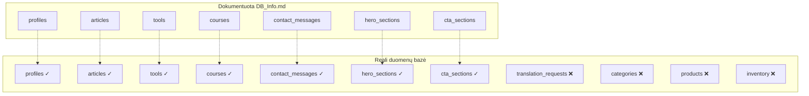
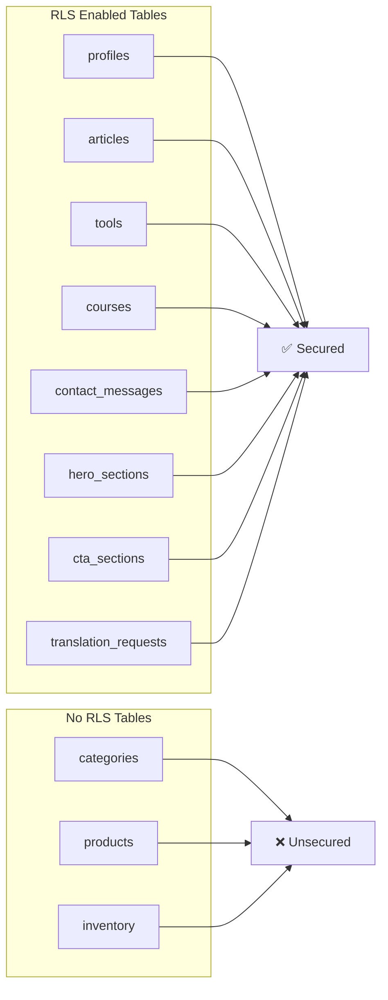

# Ponas Obuolys - Duomenų bazės analizės ataskaita

## Projekto informacija

- **Organizacija**: GretvejaTestai (ID: `swjlhbffcbuifucwvssy`)
- **Projektas**: ponasObuolys (ID: `jzixoslapmlqafrlbvpk`)
- **Regionas**: eu-central-1
- **Statusas**: ACTIVE_HEALTHY
- **PostgreSQL versija**: 15.8.1.054
- **Sukurimo data**: 2025-03-30T18:14:49.276346Z

---

## Duomenų bazės struktūros analizė

### 📊 Lentelių palyginimas: DB_Info.md vs Realybė



### ✅ Teisingai dokumentuotos lentelės

#### 1. profiles
**Dokumentacija**: ✅ Tinkama  
**Realybė**: ✅ Atitinka su papildymu

```sql
-- Dokumentuota struktūra atitinka, bet yra papildomas laukas:
ALTER TABLE profiles ADD COLUMN pareigos TEXT; -- ✅ Pridėtas laukas
```

**Skirtumas**: Pridėtas `pareigos` laukas (migracija: `20250529060432_add_pareigos_to_profiles`)

#### 2. articles
**Dokumentacija**: ✅ Tinkama  
**Realybė**: ✅ Pilnai atitinka

```sql
-- Visi laukai atitinka dokumentaciją
-- Teisingi tipai, numatytosios reikšmės ir apribojimai
```

#### 3. tools
**Dokumentacija**: ✅ Tinkama  
**Realybė**: ✅ Pilnai atitinka

#### 4. courses
**Dokumentacija**: ✅ Tinkama  
**Realybė**: ✅ Pilnai atitinka

#### 5. contact_messages
**Dokumentacija**: ✅ Tinkama  
**Realybė**: ✅ Pilnai atitinka

#### 6. hero_sections
**Dokumentacija**: ✅ Tinkama  
**Realybė**: ✅ Pilnai atitinka

#### 7. cta_sections
**Dokumentacija**: ✅ Tinkama  
**Realybė**: ✅ Pilnai atitinka

### ❌ Nedokumentuotos lentelės

#### 1. translation_requests
**Statusas**: ❌ Nenurodyта в DB_Info.md

```sql
CREATE TABLE translation_requests (
    id BIGSERIAL PRIMARY KEY,
    source_text TEXT NOT NULL,
    translated_text TEXT,
    source_lang VARCHAR DEFAULT 'EN',
    target_lang VARCHAR DEFAULT 'LT',
    chars_count INTEGER,
    status VARCHAR,
    created_at TIMESTAMPTZ DEFAULT NOW(),
    request_ip VARCHAR,
    origin_domain VARCHAR
);
```

**Paskirtis**: Vertimo užklausų žurnalas DeepL API proxy serveriui

#### 2. categories
**Statusas**: ❌ Neturėtų būti šioje duomenų bazėje

```sql
CREATE TABLE categories (
    id BIGSERIAL PRIMARY KEY,
    name VARCHAR NOT NULL,
    display_order INTEGER NOT NULL,
    created_at TIMESTAMPTZ DEFAULT NOW()
);
```

**Problema**: Ši lentelė nesusijusi su Ponas Obuolys projektu

#### 3. products
**Statusas**: ❌ Neturėtų būti šioje duomenų bazėje

```sql
CREATE TABLE products (
    id BIGSERIAL PRIMARY KEY,
    category_id BIGINT NOT NULL REFERENCES categories(id),
    name VARCHAR NOT NULL,
    unit VARCHAR NOT NULL,
    package_weight NUMERIC,
    critical_amount NUMERIC,
    is_new BOOLEAN DEFAULT TRUE,
    created_at TIMESTAMPTZ DEFAULT NOW(),
    updated_at TIMESTAMPTZ DEFAULT NOW()
);
```

**Problema**: Atsidūrė iš kito projekto, nepriklauso AI portalui

#### 4. inventory
**Statusas**: ❌ Neturėtų būti šioje duomenų bazėje

```sql
CREATE TABLE inventory (
    id BIGSERIAL PRIMARY KEY,
    product_id BIGINT NOT NULL REFERENCES products(id),
    amount NUMERIC NOT NULL,
    added_at TIMESTAMPTZ DEFAULT NOW(),
    created_at TIMESTAMPTZ DEFAULT NOW()
);
```

**Problema**: Inventoriaus valdymas nesusijęs su AI portalu

---

## RLS (Row Level Security) analizė

### ✅ Teisingai sukonfigūruotos lentelės



**RLS Politikos problemos**:
- `categories`, `products`, `inventory` lentelės **NETURI** RLS apsaugos
- Tai kelia saugumo riziką, nors šios lentelės ir neturėtų egzistuoti

---

## Funkcijų analizė

### ✅ Aptiktos funkcijos

```sql
-- 1. Admin patikrinimas
CREATE OR REPLACE FUNCTION is_admin(user_id UUID)
RETURNS BOOLEAN AS $$
BEGIN
    RETURN EXISTS (
        SELECT 1 FROM profiles 
        WHERE id = user_id AND is_admin = true
    );
END;
$$ LANGUAGE plpgsql;

-- 2. Auth vartotojų gavimas
CREATE OR REPLACE FUNCTION get_auth_users()
RETURNS TABLE(id UUID, email TEXT, created_at TIMESTAMPTZ);

-- 3. Profilių su el. paštais gavimas
CREATE OR REPLACE FUNCTION get_profiles_with_emails()
RETURNS TABLE(
    id UUID, username TEXT, avatar_url TEXT, 
    is_admin BOOLEAN, created_at TIMESTAMPTZ, 
    updated_at TIMESTAMPTZ, email TEXT
);
```

### Views (Vaizdai)

```sql
-- 1. Auth vartotojų vaizdas
CREATE VIEW auth_users_view AS
SELECT id, email, created_at FROM auth.users;

-- 2. Vartotojų profilių vaizdas
CREATE VIEW user_profiles AS
SELECT 
    p.*, 
    u.email,
    u.created_at as auth_created_at
FROM profiles p
JOIN auth.users u ON p.id = u.id;
```

---

## Migracijos istorija

### ✅ Dokumentuotos migracijos

```sql
-- 2025-05-29: Pridėtas pareigos laukas
-- Migracija: 20250529060432_add_pareigos_to_profiles
ALTER TABLE profiles ADD COLUMN pareigos TEXT;
```

**Problema**: Ši migracija **nėra** aprašyta DB_Info.md faile

---

## Duomenų statistika

### 📈 Lentelių užpildymas

| Lentelė | Gyvi įrašai | Ištrinti įrašai | Dydis |
|---------|-------------|-----------------|-------|
| **profiles** | 2 | 6 | 48 kB |
| **articles** | 8 | 2 | 168 kB |
| **tools** | 50 | 30 | 96 kB |
| **courses** | 4 | 1 | 96 kB |
| **contact_messages** | 0 | 0 | 16 kB |
| **hero_sections** | 0 | 0 | 16 kB |
| **cta_sections** | 0 | 0 | 16 kB |
| **translation_requests** | 0 | 0 | 32 kB |
| **categories** ❌ | 11 | 0 | 32 kB |
| **products** ❌ | 272 | 0 | 80 kB |
| **inventory** ❌ | 273 | 0 | 72 kB |

---

## Saugumo ir architektūros problemos

### 🔴 Kritinės problemos

1. **Svetimos lentelės duomenų bazėje**
   ```sql
   -- Šios lentelės neturėtų egzistuoti:
   DROP TABLE inventory;    -- 273 įrašai
   DROP TABLE products;     -- 272 įrašai  
   DROP TABLE categories;   -- 11 įrašų
   ```

2. **RLS neįjungtas svetimoms lentelėms**
   - `categories.rls_enabled = false`
   - `products.rls_enabled = false`
   - `inventory.rls_enabled = false`

3. **Duomenų bazės užteršimas**
   - Duomenų bazėje yra inventoriaus valdymo duomenys
   - Maišosi skirtingų projektų logika

### 🟡 Vidutinės problemos

1. **Dokumentacijos atsilikimas**
   - `translation_requests` lentelė nedokumentuota
   - `pareigos` laukas `profiles` lentelėje nepaminėtas
   - Migracijos istorija neišsami

2. **Neunikalūs pavadinimų konvencijos**
   - Kai kurios lentelės naudoja `BIGSERIAL` vietoj `UUID`
   - Nesuderinamumas su pagrindiniu dizainu

---

## Rekomendacijos

### 🎯 Skubūs veiksmai

1. **Išvalyti duomenų bazę**
   ```sql
   -- ATSARGIAI: Prieš vykdant padaryti backup!
   DROP TABLE IF EXISTS inventory CASCADE;
   DROP TABLE IF EXISTS products CASCADE;  
   DROP TABLE IF EXISTS categories CASCADE;
   ```

2. **Atnaujinti dokumentaciją**
   ```markdown
   # Pridėti į DB_Info.md:
   
   ### 8. translation_requests
   Stores translation request logs for DeepL API proxy.
   - `id` (BIGSERIAL, PK): Unique identifier
   - `source_text` (TEXT): Original text
   - `translated_text` (TEXT, nullable): Translated text
   - `source_lang` (VARCHAR): Source language code
   - `target_lang` (VARCHAR): Target language code
   - `chars_count` (INTEGER): Character count
   - `status` (VARCHAR): Request status
   - `created_at` (TIMESTAMP): Creation timestamp
   - `request_ip` (VARCHAR): Client IP address
   - `origin_domain` (VARCHAR): Origin domain
   ```

3. **Atnaujinti profiles lentelės dokumentaciją**
   ```markdown
   # Pridėti į DB_Info.md profiles sekcijoje:
   - `pareigos` (TEXT, nullable): User position/role description
   ```

### 🔧 Architektūros patobulinimai

1. **Migracijų dokumentavimas**
   ```sql
   -- Sukurti migracijų dokumentacijos sistemą
   CREATE TABLE migration_log (
       version VARCHAR PRIMARY KEY,
       name VARCHAR NOT NULL,
       description TEXT,
       applied_at TIMESTAMPTZ DEFAULT NOW()
   );
   ```

2. **RLS politikų peržiūra**
   ```sql
   -- Patikrinti visas RLS politikas
   SELECT schemaname, tablename, policyname 
   FROM pg_policies 
   WHERE schemaname = 'public';
   ```

### 📚 Dokumentacijos standartizavimas

1. **Sukurti lentelių aprašymų šabloną**
2. **Įdiegti automatinį dokumentacijos generavimą**
3. **Reguliariai sinchronizuoti dokumentaciją su realybe**

---

## Išvados

### ✅ Teigiami aspektai

1. **Pagrindinė architektūra tvarka** - visos AI portalo lentelės egzistuoja ir veikia
2. **RLS apsauga įjungta** pagrindinėms lentelėms
3. **Teisingi duomenų tipai** ir apribojimai
4. **Funkcionalios funkcijos** admin tikrinimui ir duomenų gavimui

### ❌ Problemos

1. **Duomenų bazės užteršimas** svetimomis lentelėmis (categories, products, inventory)
2. **Dokumentacijos atsilikimas** nuo realybės
3. **Saugumo spragos** svetimose lentelėse
4. **Migracijos neišsektos** dokumentacijoje

### 🎯 Prioritetiniai veiksmai

1. **Skubiai**: Išvalyti svetimas lenteles
2. **Trumpalaikiai**: Atnaujinti dokumentaciją
3. **Ilgalaikiai**: Įdiegti automatinį dokumentacijos sinchronizavimą

---

## Techniniai duomenys

- **Duomenų bazės dydis**: ~656 kB
- **Lentelių skaičius**: 11 (7 tinkamos + 4 svetimos)
- **RLS įjungta**: 8/11 lentelių
- **Migracijos**: 1 dokumentuota
- **Funkcijos**: 3 sukurtos
- **Views**: 2 sukurti

**Rekomendacija**: Duomenų bazės struktūra yra tinkama AI portalui, bet reikia skubaus valymo ir dokumentacijos atnaujinimo. 