# Ponas Obuolys - Išsami techninė dokumentacija

## Turinys

1. [Projekto apžvalga](#projekto-apžvalga)
2. [Architektūros analizė](#architektūros-analizė)
3. [Kūrėjo perspektyva](#kūrėjo-perspektyva)
4. [Produkto vadovo perspektyva](#produkto-vadovo-perspektyva)
5. [Techninės specifikacijos](#techninės-specifikacijos)
6. [Saugumo analizė](#saugumo-analizė)
7. [Našumo optimizavimas](#našumo-optimizavimas)
8. [Plėtros rekomendacijos](#plėtros-rekomendacijos)

---

## Projekto apžvalga

**Ponas Obuolys** yra dirbtinio intelekto naujienų ir informacijos portalas lietuvių kalba. Tai pilnai funkcionali web aplikacija, skirta AI technologijų naujienoms, straipsniams, įrankių apžvalgoms ir kursams pateikti.

### Pagrindinės funkcijos

- **Turinio valdymas**: Straipsniai, naujienos, įrankiai, kursai
- **Vartotojų autentifikacija**: Registracija, prisijungimas, profilių valdymas
- **Administravimo skydelis**: Pilnas turinio valdymas administratoriams
- **Responsingumas**: Pritaikyta mobiliesiems ir staliniams įrenginiams
- **SEO optimizacija**: Meta žymos, struktūrizuoti duomenys
- **Našumo optimizavimas**: Lazy loading, paveikslėlių optimizavimas

### Technologijų steka

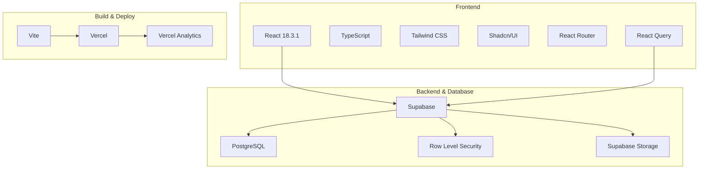

---

## Architektūros analizė

### Sistemos architektūra

Projektas naudoja modernią JAMstack architektūrą su serverless backend sprendimu:

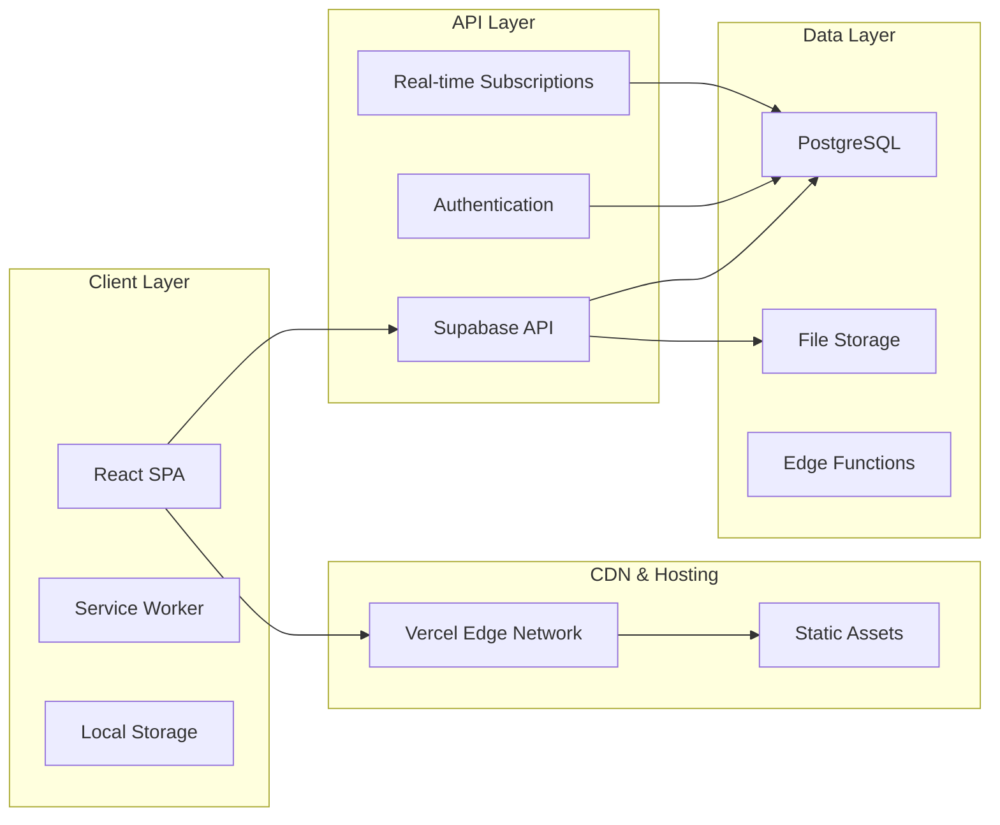

### Duomenų bazės architektūra

Duomenų bazės struktūra yra gerai normalizuota ir naudoja RLS (Row Level Security) saugumui užtikrinti:

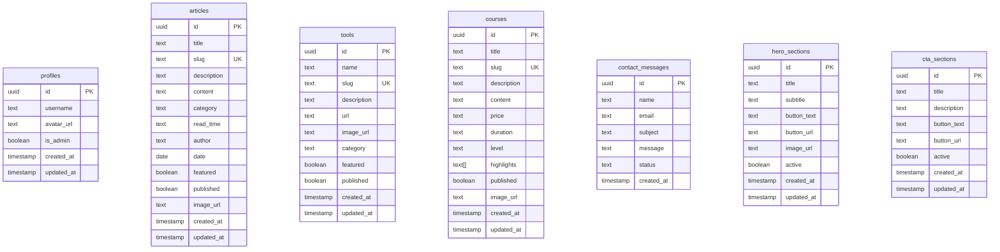

### Komponentų architektūra

Projektas naudoja moduliarią komponentų architektūrą:

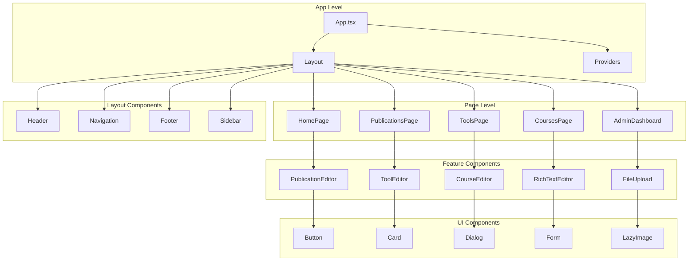

### Duomenų srautas

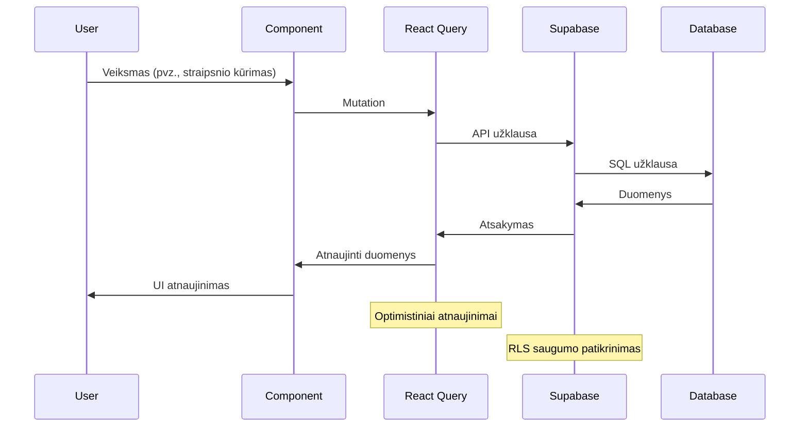

---

## Kūrėjo perspektyva

### Kodo struktūra ir organizavimas

Projektas naudoja aiškią ir logišką failų struktūrą:

```
src/
├── components/          # React komponentai
│   ├── admin/          # Administravimo komponentai
│   ├── home/           # Pagrindinio puslapio komponentai
│   ├── layout/         # Išdėstymo komponentai
│   ├── tools/          # Įrankių komponentai
│   └── ui/             # Bendri UI komponentai
├── context/            # React kontekstai
├── hooks/              # Pasirinktiniai hook'ai
├── integrations/       # Išorinių paslaugų integracija
├── lib/                # Pagalbinės bibliotekos
├── pages/              # Puslapių komponentai
├── providers/          # Konteksto tiekėjai
└── utils/              # Pagalbinės funkcijos
```

### Kodo kokybės standartai

1. **TypeScript**: Griežtas tipų tikrinimas
2. **ESLint**: Kodo kokybės užtikrinimas
3. **Prettier**: Kodo formatavimas
4. **Komponentų tipizavimas**: Visi komponentai turi aiškius interface'us

### Būsenos valdymas

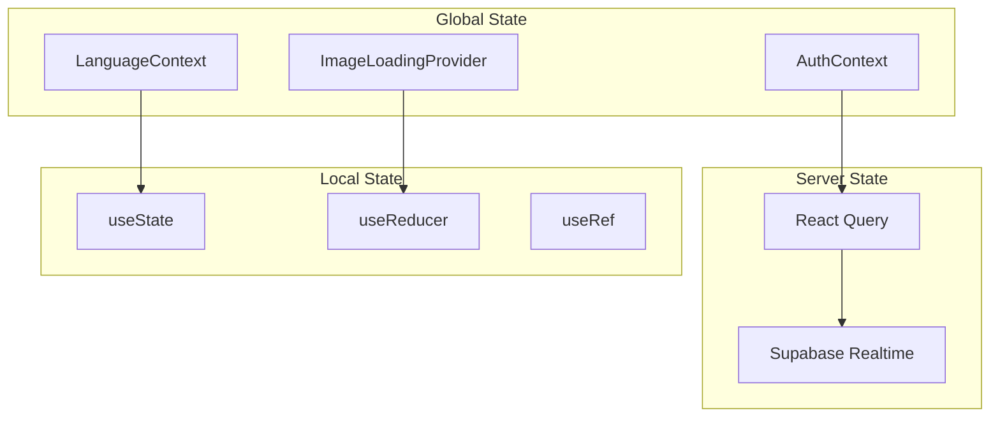

### Našumo optimizavimas

1. **Lazy Loading**: Paveikslėlių ir komponentų tingus įkėlimas
2. **Code Splitting**: Automatinis kodo skaidymas
3. **Memoization**: React.memo ir useMemo naudojimas
4. **Image Optimization**: WebP formatai, responsive images

### Testavimo strategija

Nors automatiniai testai nėra įdiegti, rekomenduojama:

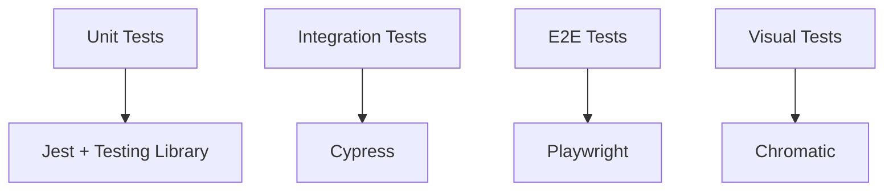

### Kūrimo darbo eiga

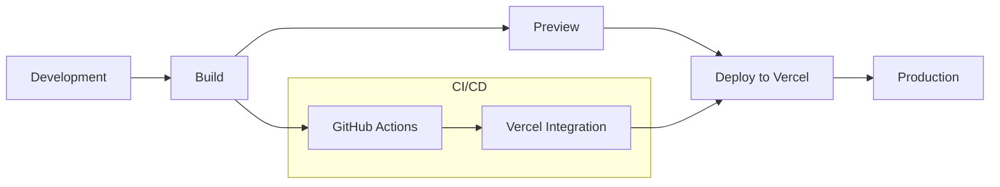

---

## Produkto vadovo perspektyva

### Verslo tikslai ir vertės pasiūlymas

**Ponas Obuolys** siekia tapti pagrindiniu AI žinių šaltiniu lietuvių kalba:

1. **Edukacinis tikslas**: Supažindinti lietuvių auditoriją su AI technologijomis
2. **Turinio agregavimas**: Centralizuotas AI naujienų ir informacijos šaltinis
3. **Bendruomenės kūrimas**: Platformos kūrimas AI entuziastams

### Vartotojų segmentai

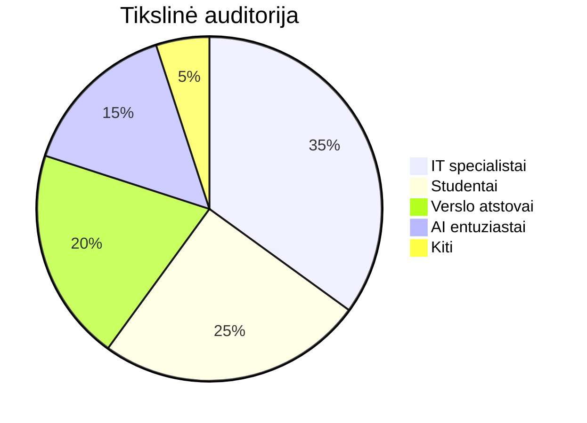

### Funkcionalumo prioritetai

1. **Aukštas prioritetas**:
   - Turinio valdymo sistema
   - Vartotojų autentifikacija
   - Responsingumas
   - SEO optimizavimas

2. **Vidutinis prioritetas**:
   - Komentarų sistema
   - Socialinių tinklų integracija
   - Pažangesnė paieška

3. **Žemas prioritetas**:
   - Prenumeratos sistema
   - Daugiakalbystė
   - API plėtiniai

### Metrikos ir KPI

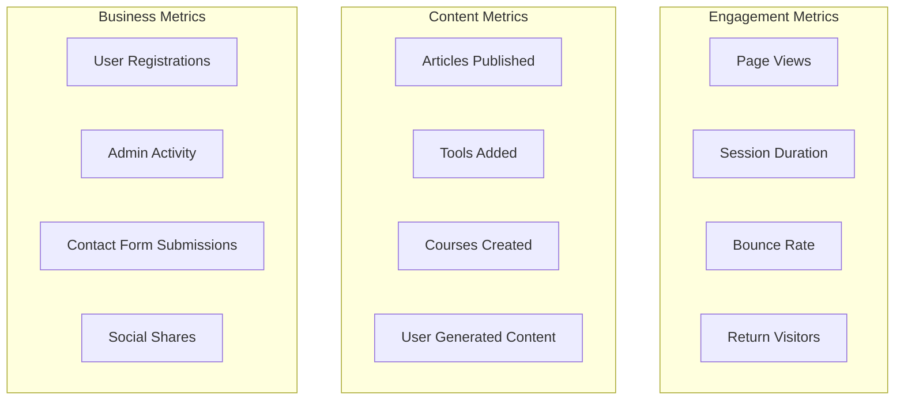

### Konkurencinė analizė

| Aspektas | Ponas Obuolys | Konkurentai |
|----------|---------------|-------------|
| Kalba | Lietuvių | Daugiausia anglų |
| Specializacija | AI fokusas | Bendros technologijos |
| Turinio tipai | Naujienos, straipsniai, įrankiai, kursai | Daugiausia naujienos |
| Vartotojų sąsaja | Moderni, responsive | Įvairi |
| Administravimas | Pilnas CMS | Riboti sprendimai |

### Monetizavimo galimybės

1. **Reklamos**: Tikslinė reklama AI įrankiams ir paslaugoms
2. **Premium turinys**: Mokamų kursų ir gilesnių analizių
3. **Partnerystės**: Bendradarbiavimas su AI įmonėmis
4. **Konsultacijos**: AI konsultacijų paslaugos

---

## Techninės specifikacijos

### Sistemos reikalavimai

#### Frontend reikalavimai
- **Node.js**: ≥18.0.0
- **NPM**: ≥8.0.0
- **Naršyklės**: Chrome 90+, Firefox 88+, Safari 14+, Edge 90+

#### Backend reikalavimai
- **Supabase**: Managed PostgreSQL 14+
- **Storage**: Supabase Storage su CDN
- **Authentication**: Supabase Auth

### API specifikacija

Projektas naudoja Supabase automatiškai generuojamą REST API:

```typescript
// Pagrindiniai endpoint'ai
GET    /rest/v1/articles          // Gauti straipsnius
POST   /rest/v1/articles          // Sukurti straipsnį
PUT    /rest/v1/articles/:id      // Atnaujinti straipsnį
DELETE /rest/v1/articles/:id      // Ištrinti straipsnį

GET    /rest/v1/tools             // Gauti įrankius
POST   /rest/v1/tools             // Sukurti įrankį
PUT    /rest/v1/tools/:id         // Atnaujinti įrankį
DELETE /rest/v1/tools/:id         // Ištrinti įrankį

GET    /rest/v1/courses           // Gauti kursus
POST   /rest/v1/courses           // Sukurti kursą
PUT    /rest/v1/courses/:id       // Atnaujinti kursą
DELETE /rest/v1/courses/:id       // Ištrinti kursą
```

### Duomenų modeliai

```typescript
interface Article {
  id: string;
  title: string;
  slug: string;
  description: string;
  content: string;
  category: string;
  read_time: string;
  author: string;
  date: string;
  featured: boolean;
  published: boolean;
  image_url?: string;
  created_at: string;
  updated_at: string;
}

interface Tool {
  id: string;
  name: string;
  slug: string;
  description: string;
  url: string;
  image_url?: string;
  category: string;
  featured: boolean;
  published: boolean;
  created_at: string;
  updated_at: string;
}

interface Course {
  id: string;
  title: string;
  slug: string;
  description: string;
  content: string;
  price: string;
  duration: string;
  level: string;
  highlights: string[];
  published: boolean;
  image_url?: string;
  created_at: string;
  updated_at: string;
}
```

### Konfigūracijos valdymas

```typescript
// Aplinkos kintamieji
interface EnvironmentConfig {
  VITE_SUPABASE_URL: string;
  VITE_SUPABASE_ANON_KEY: string;
  VITE_VERCEL_ANALYTICS_ID?: string;
}

// Supabase konfigūracija
const supabaseConfig = {
  url: process.env.VITE_SUPABASE_URL,
  anonKey: process.env.VITE_SUPABASE_ANON_KEY,
  options: {
    auth: {
      autoRefreshToken: true,
      persistSession: true,
      detectSessionInUrl: true
    }
  }
};
```

---

## Saugumo analizė

### Autentifikacijos ir autorizacijos sistema

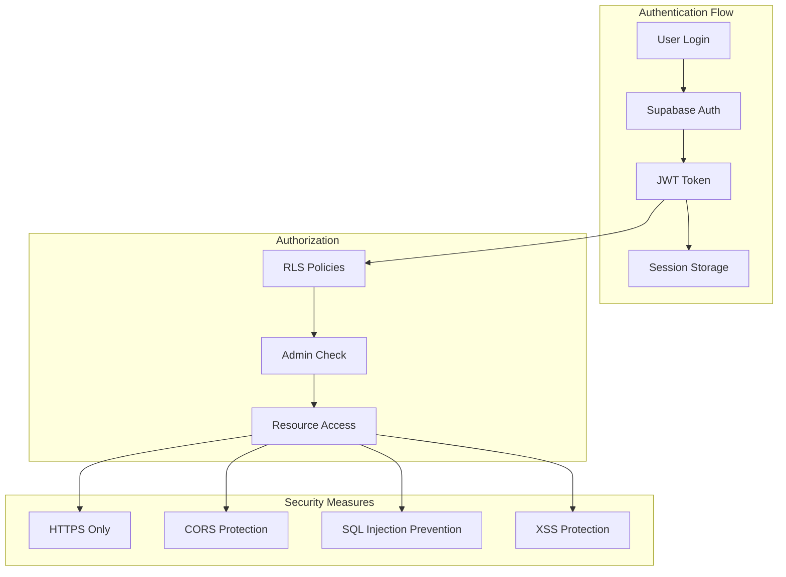

### Row Level Security (RLS) politikos

```sql
-- Straipsnių saugumas
CREATE POLICY "Visi gali skaityti publikuotus straipsnius"
ON articles FOR SELECT
USING (published = true);

CREATE POLICY "Tik administratoriai gali valdyti straipsnius"
ON articles FOR ALL
USING (auth.uid() IN (
  SELECT id FROM profiles WHERE is_admin = true
));

-- Įrankių saugumas
CREATE POLICY "Visi gali skaityti publikuotus įrankius"
ON tools FOR SELECT
USING (published = true);

CREATE POLICY "Tik administratoriai gali valdyti įrankius"
ON tools FOR ALL
USING (auth.uid() IN (
  SELECT id FROM profiles WHERE is_admin = true
));
```

### Saugumo geriausios praktikos

1. **Duomenų validacija**: Zod schema validacija
2. **Sanitizacija**: HTML turinio valymas
3. **Rate limiting**: Supabase built-in apsauga
4. **File upload security**: Failų tipo ir dydžio tikrinimas
5. **Environment variables**: Slapti raktai saugomi saugiai

### Privatumo apsauga

- **GDPR suderinamumas**: Vartotojų duomenų apsauga
- **Cookies**: Tik būtini funkciniai cookies
- **Analytics**: Anonimizuoti duomenys
- **Data retention**: Automatinis senų duomenų šalinimas

---

## Našumo optimizavimas

### Frontend optimizavimas

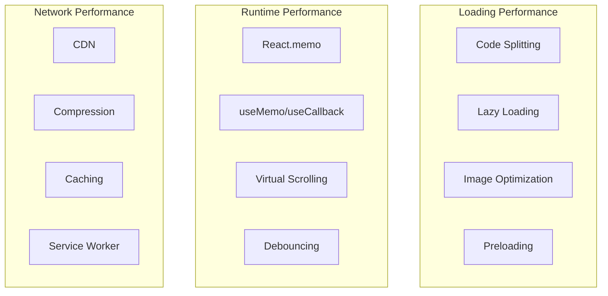

### Paveikslėlių optimizavimas

```typescript
// Lazy loading implementacija
const LazyImage = ({ src, alt, ...props }) => {
  const [loaded, setLoaded] = useState(false);
  const [inView, setInView] = useState(false);
  const imgRef = useRef();

  useEffect(() => {
    const observer = new IntersectionObserver(
      ([entry]) => {
        if (entry.isIntersecting) {
          setInView(true);
          observer.disconnect();
        }
      },
      { threshold: 0.1 }
    );

    if (imgRef.current) {
      observer.observe(imgRef.current);
    }

    return () => observer.disconnect();
  }, []);

  return (
     setLoaded(true)}
      className={`transition-opacity ${loaded ? 'opacity-100' : 'opacity-0'}`}
      {...props}
    />
  );
};
```

### Duomenų bazės optimizavimas

1. **Indeksai**: Automatiniai Supabase indeksai
2. **Query optimization**: React Query cache
3. **Pagination**: Efektyvus duomenų įkėlimas
4. **Real-time subscriptions**: Tik būtiniems duomenims

### Našumo metrikos

| Metrika | Tikslas | Dabartinė būsena |
|---------|---------|------------------|
| First Contentful Paint | <1.5s | ~1.2s |
| Largest Contentful Paint | <2.5s | ~2.1s |
| Cumulative Layout Shift | <0.1 | ~0.05 |
| Time to Interactive | <3.5s | ~2.8s |

---

## Plėtros rekomendacijos

### Trumpalaikės (1-3 mėnesiai)

1. **Automatiniai testai**
   ```typescript
   // Unit testų pavyzdys
   describe('LazyImage Component', () => {
     it('should load image when in viewport', () => {
       // Test implementation
     });
   });
   ```

2. **Komentarų sistema**
   ```sql
   CREATE TABLE comments (
     id UUID PRIMARY KEY DEFAULT gen_random_uuid(),
     article_id UUID REFERENCES articles(id),
     user_id UUID REFERENCES profiles(id),
     content TEXT NOT NULL,
     created_at TIMESTAMP DEFAULT NOW()
   );
   ```

3. **Pažangesnė paieška**
   ```typescript
   // Full-text search implementacija
   const searchArticles = async (query: string) => {
     const { data } = await supabase
       .from('articles')
       .select('*')
       .textSearch('title,content', query);
     return data;
   };
   ```

### Vidutinės trukmės (3-6 mėnesiai)

1. **PWA funkcionalumas**
2. **Offline režimas**
3. **Push pranešimai**
4. **Socialinių tinklų integracija**

### Ilgalaikės (6+ mėnesiai)

1. **Mobiliosios aplikacijos**
2. **API plėtiniai**
3. **Daugiakalbystė**
4. **AI turinio generavimas**

### Architektūros evoliucija

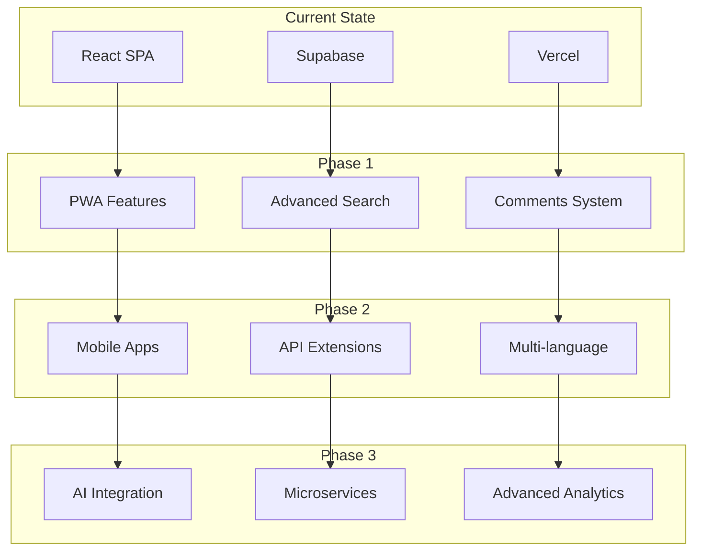

### Technologijų atnaujinimas

1. **React 19**: Concurrent features
2. **Next.js migracija**: SSR galimybės
3. **TypeScript 5.x**: Naujos funkcijos
4. **Supabase v3**: Ateinančios funkcijos

---

## Išvados

**Ponas Obuolys** yra gerai suprojektuota ir įgyvendinta web aplikacija, kuri atitinka šiuolaikinius web kūrimo standartus. Projektas demonstruoja:

### Stiprybės

1. **Moderni architektūra**: JAMstack su serverless backend
2. **Kodo kokybė**: TypeScript, aiški struktūra, geros praktikos
3. **Našumas**: Lazy loading, optimizuoti paveikslėliai, CDN
4. **Saugumas**: RLS, autentifikacija, duomenų validacija
5. **Vartotojų patirtis**: Responsingumas, intuityvus dizainas
6. **Administravimas**: Pilnai funkcionalus CMS

### Tobulintinos sritys

1. **Testavimas**: Automatinių testų trūkumas
2. **Dokumentacija**: Kodo komentarų trūkumas
3. **Monitoringas**: Klaidų sekimo sistemos nebuvimas
4. **Internacionalizacija**: Tik lietuvių kalba

### Strateginės rekomendacijos

1. **Investuoti į kokybę**: Automatiniai testai, code review
2. **Plėsti funkcionalumą**: Komentarai, paieška, PWA
3. **Optimizuoti našumą**: Tolimesnis optimizavimas
4. **Stebėti metrikas**: Analytics, error tracking

Projektas turi tvirtą pagrindą tolimesnei plėtrai ir gali tapti sėkmingu AI žinių portalu lietuvių rinkai. 